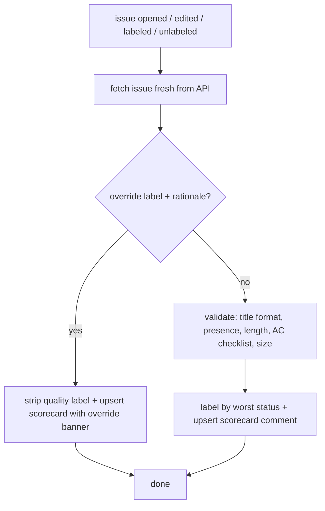

# repo-contract

The deterministic repository contract for GitHub issues, pull requests, and commits, so work lands
well-scoped and actionable. Structural checks only: title format, presence,
length, checklist count, size enum. The **issue gate** is advisory (labels +
scorecard, never fails CI); the **PR gate** and the **commit-hygiene gate** both
hard-fail CI so a red check blocks merge. All three are callers of one shared
core; see the [PR gate](#pull-request-gate), the
[commit-hygiene gate](#commit-hygiene-gate), and [`CONTEXT.md`](CONTEXT.md).

## Features

- **Deterministic checks**: Conventional Commits title, presence, min/max
  length, acceptance-criteria checklist count, size enum. Same rules every time.
- **Scorecard comment**: every run upserts one **Issue Quality Checklist** with
  a ✅ / ⚠️ / ❌ line per check, so a clean issue gets confirmation, not silence.
- **Three mutually-exclusive labels**: `issue-quality:failing` (hard block),
  `issue-quality:warning` (non-blocking), `issue-quality:pass`, a filterable
  signal for downstream automation.
- **Manual override**: a labelled escape hatch with a required written rationale.
- **One-command opt-in**: `npx github:orestes-dev/repo-contract init` drops
  the Issue Form + PR Form, their workflows, and the repo-contract git hooks,
  and prints a Suggested rule to paste into your agent rules; no per-repo config.
- **Vendored git hooks**: `init` ships committed husky hooks enforcing the
  repo-contract baseline (Conventional Commits, em-dash policy, no default-branch
  commits) with `jq`/`git`/`sh` only, so they run in CI, containers, and fresh
  worktrees, and are drift-checked like every other rendering.
- **Shared pre-flight validator**: run the same checks locally before
  `gh issue create`.

## What it checks

The fields and their headings are owned in code by the ordered descriptor in
[`src/rules.js`](src/rules.js), read at runtime; the Issue Form
([`.github/ISSUE_TEMPLATE/task.yml`](.github/ISSUE_TEMPLATE/task.yml)) is a
drift-checked rendering of it for GitHub's new-issue UI, never read at runtime.
The table below is the human-readable bar for the rules layered on top.

| Field                             | Rule                                          | Severity                 |
| --------------------------------- | --------------------------------------------- | ------------------------ |
| **Title**                         | Conventional Commits `type(scope): summary`   | error                    |
| **Context**                       | present, ≥ 30 chars                           | error                    |
| **Context**                       | ≤ 1500 chars                                  | warning (fluff detector) |
| **Acceptance Criteria**           | ≥ 1 non-empty checklist item (`- [ ]`)        | error                    |
| **Out of Scope**                  | present, ≥ 10 chars                           | error                    |
| **Decisions**                     | present (settled choices + rationale)         | warning if empty         |
| **Affected files / entry points** | present (files/symbols the work touches)      | warning if empty         |
| **Depends on**                    | optional (prerequisite issues / merge order)  | none                     |
| **Size**                          | one of `XS / S / M / L / XL`                  | error                    |
| **Size**                          | not `L` / `XL` (too big to land as one issue) | error                    |

Title is issue metadata, not a body section, so it leads the scorecard rather
than being derived from the field descriptor. Decisions and Affected files are optional but
recommended: empty raises a non-blocking warning, since both sharpen an issue
for whoever (human or agent) implements it.

The worst per-check status sets one mutually-exclusive label:

| Outcome               | Label                   |
| --------------------- | ----------------------- |
| ≥ 1 error             | `issue-quality:failing` |
| 0 errors, ≥ 1 warning | `issue-quality:warning` |
| clean                 | `issue-quality:pass`    |

Every run upserts the scorecard comment, an override included: no run ever
leaves an issue without one.

```md
### Issue Quality Checklist

- ✅ **Title**: Conventional Commits: `type(scope): summary`
- ✅ **Context**: 30–1500 characters
- ✅ **Acceptance Criteria**: at least one checklist item
- ❌ **Out of Scope**: at least 10 characters
- ⚠️ **Decisions**: recommended; add it so implementers aren't left guessing
- ✅ **Affected files / entry points**: present
- ✅ **Depends on**: optional; not provided
- ✅ **Size**: XS, S, or M lands as one issue
```

### Override

Set `override:issue-quality` **and** add a non-empty `## Override rationale`
section to bypass: the quality label is stripped, but the scorecard stays and
leads with a banner acknowledging the bypass, so the record of what the gate
found survives the override. The label without a rationale does not bypass; it
raises a warning to write one.

## Consuming the gate's output

The labels are a filterable signal for downstream automation (or a saved search).
An issue is **gate-cleared** when the gate cleared it or a human waived the
block: `issue-quality:pass`, `issue-quality:warning` (non-blocking by design), or
`override:issue-quality`. Query clearance as a positive union of those labels:

```text
is:issue is:open label:issue-quality:pass,issue-quality:warning,override:issue-quality
```

GitHub OR's comma-separated `label:` terms, so this matches any of the three.
Filter to only pristine issues by dropping the last two terms; that is a
stricter-than-cleared policy a consumer opts into, not the default meaning of clearance.

Do **not** express clearance as `-label:issue-quality:failing`. The negative form
also matches issues the gate never evaluated (opened before CI ran, a repo not
opted in, a run still in flight), which carry no quality label at all. Clearance
requires an affirmative signal that the gate reached a verdict, so always list the
cleared labels explicitly.

Gate-clearance means the issue is legible, not that it is ready to implement.
Whether the design is settled is a separate, downstream decision (e.g. a
consumer's own `ready-to-implement` label) the gate does not make; don't read
pickup-readiness into a cleared label.

## Opting a repo in

```sh
npx github:orestes-dev/repo-contract init
```

Run from the repo root. This drops seven files, which together are the opt-in:

- `.github/ISSUE_TEMPLATE/task.yml`: the Issue Form (GitHub-UI rendering of the
  `src/rules.js` structure, drift-checked against it).
- `.template.issue.md`: the [issue Author guide](#the-issue-author-guide) (the
  LLM-facing rendering of the same structure).
- `.github/workflows/issue-quality.yml`: a thin workflow calling the shared
  Action at `@main` for the issue gate.
- `.github/PULL_REQUEST_TEMPLATE.md`: the PR Form (required sections), the body
  GitHub posts on a new PR.
- `.template.pr.md`: the [PR Author guide](#the-pr-author-guide), byte-identical
  to the PR Form, the path an agent drafts a PR body against.
- `.github/workflows/pr-readiness.yml`: a thin workflow calling the shared Action
  at `@main` for the PR gate (merge-blocking).
- `.github/workflows/commit-hygiene.yml`: a thin workflow calling the shared
  Action at `@main` for the [commit-hygiene gate](#commit-hygiene-gate)
  (merge-blocking). No Form or Author guide: it reads the PR's commits and diff,
  not a body the author fills in.

Commit all seven. `init` then prints a Suggested rule to stdout: an agent-guidance
snippet pointing at the issue and PR Author guides and at the pre-flight step,
for you to paste into your own agent-rules file (`AGENTS.md`, `CLAUDE.md`, editor
rules). `init` writes it to no file, so it never clobbers a file it does not own.

The snippet names no subcommand or flag, and defers to `repo-contract --help` for
the command surface. A pasted copy is beyond this repo's reach forever after, so
anything it pins about the CLI rots silently the next time the CLI moves. `--help`
is generated from the live CLI and cannot go stale.

### The issue Author guide

`.template.issue.md` is the LLM-facing companion to the Issue Form: a section per
field carrying the examples, voice, and guidance the GitHub YAML form cannot hold,
for an agent to follow when drafting an issue body. GitHub ignores it (the name is
not a reserved template path, so it never pollutes the new-issue chooser). It is a
rendering of the same `src/rules.js` structure as the Issue Form: only its
headings and their order are drift-checked; its prose is deliberately richer and
free to differ. The Suggested rule points agents at it.

### The PR Author guide

`.template.pr.md` is the LLM-facing companion to the PR Form, and unlike the issue
Author guide it is byte-identical to the native template: `init` writes the one
canonical `templates/markdown/pr.md` to both `.github/PULL_REQUEST_TEMPLATE.md`
(the body GitHub posts) and root `.template.pr.md` (the path an agent drafts
against), and a drift test keeps the two the same bytes. Because those bytes end
up in the posted PR body, all authoring guidance lives in HTML comments so it
never prints into the PR (ADR 0003). GitHub ignores `.template.pr.md` (the name is
not a reserved template path). The Suggested rule points agents at it.

Re-running `init` later is safe: unchanged files are left alone. If a bundled
template has moved on and your copy is stale (or you edited it locally), `init`
writes nothing and exits 1, listing what drifted. Re-run `init --force` to
overwrite the drifted files in place; since they are committed, `git diff`
afterwards shows exactly what changed and lets you restore any local edits.

CI runs on `issues: opened` / `edited` always, and on `labeled` /
`unlabeled` only when a human touches `override:issue-quality` or an
`issue-quality:*` label. The gate's own label writes (as the CI bot) are
excluded, so it never re-triggers itself; a human hand-editing a quality label
re-runs it, so manual changes self-heal.

Blank or freeform issues (any `gh issue create` body) skip the form and land as
`issue-quality:failing`, so nothing bypasses the gate. To stop blank issues
entirely, add `.github/ISSUE_TEMPLATE/config.yml` with
`blank_issues_enabled: false` yourself.

The gate labels issues going forward, from the first event on each. To label the
existing backlog too, run [`sweep`](#backfilling-the-backlog) once after opting
in.

## Backfilling the backlog

Opt-in is going-forward only: an existing issue is validated the next time it is
edited, so an untouched backlog stays unlabeled. To backfill on demand, run:

```sh
npx github:orestes-dev/repo-contract sweep
```

`sweep` labels + scorecards every **open** issue that has no `issue-quality:*`
label yet, running each through the same gate the CI action does. It takes no
flags: it reads credentials from `gh auth token` and the target repo from
`gh repo view`, so run it inside an authenticated clone of the repo.

- **Idempotent and re-runnable.** Already-labeled issues are filtered out server
  side, so they are never touched or re-notified; only unlabeled issues are
  swept. Re-running only picks up new arrivals.
- **Resilient.** A failure on one issue is reported and the sweep continues; the
  run exits non-zero if any issue failed, so you can re-run to retry just those.
- **Backlogs over 1000.** GitHub caps issue search at 1000 results. Because
  sweeping labels an issue (dropping it from the query), `sweep` prints a notice
  when more remain; re-run until it stops.

Labels are created on first use with intentional colors and descriptions, so
`sweep` (or the first CI run) also materializes the three `issue-quality:*`
labels in the repo; there is no separate label-setup step.

## Pre-flight validation

Before `gh issue create`, run the same validator on a draft file. Pass
`--title` to also check the title against the Conventional Commits format:

```sh
npx github:orestes-dev/repo-contract validate-issue path/to/issue-body.md \
  --title "feat(search): debounce the query input"
```

The file must use the same `### ` headings the gate requires (Decisions,
Affected files, and Depends on are optional):

```md
### Context

<what needs to happen and why>

### Acceptance Criteria

- [ ] <verifiable outcome>

### Out of Scope

- <explicit non-goal>

### Decisions

- <settled choice: rationale>

### Affected files / entry points

- <path/to/file: symbol>

### Size

S
```

Exits non-zero on errors. One validator backs both CI and pre-flight. Without
`--title` the title check is skipped (a body file carries no title).

## Flow



## Pull request gate

A second entry point runs the same core over a pull request on `pull_request`
events. It checks structural presence, never conformance:

- **Title**: Conventional Commits `type(scope): summary`, same rule as issues.
- **Required sections**: `## Summary`, `## Verification`, `## Scope`, and
  `## Decisions` present and non-empty. `Scope` names the app/package/area the PR
  touches (a repo's own governance may enforce the boundary itself); `Decisions`
  records the settled choices and any ADR added or followed (`None` is a valid,
  explicit answer). Both mirror the issue gate's `Decisions` and affected-files
  vocabulary, so a PR and the issue it closes speak the same sections.
- **Divergence**: the `## Divergence` section is optional until its checkbox is
  checked. A checked flag with no written rationale hard-fails; unchecked (or
  checked with a rationale) passes. The gate checks the rationale is present,
  never whether the code conforms to the issue.
- **Linked-issue readiness**: every issue the PR closes (GitHub's native
  `closingIssuesReferences`, from `Closes #N` or the Development sidebar) must be
  ready, the same `issue-quality:pass` / `warning` / `override:issue-quality`
  union a consumer uses to pick up an issue. A PR that closes zero same-repo
  issues hard-fails, since each closed issue is a spec it claims to satisfy.
  Cross-repo links are ignored (the token can't read another repo's labels) and
  the scorecard says so. The check re-runs only on PR events, so when a linked
  issue flips to ready afterward the scorecard tells you to re-run it.

The PR structure is defined by a code descriptor (`src/pr-validator.js`), the
source of truth the Markdown template is drift-tested against. Any error (a
missing section, a non-conventional title) **hard-fails CI**, turning the check
red and blocking merge; warnings stay green. Outcomes carry exactly one of
`pr-readiness:pass` / `pr-readiness:warning` / `pr-readiness:failing` plus an upserted
**PR Readiness Checklist** scorecard, both diff-based like the issue gate.

Bot-authored PRs (actor login ends in `[bot]`) auto-pass with no override, since
no human is present to apply one. A human bypasses with `override:pr-readiness`
plus a `## Override rationale` section, mirroring the issue override. The
consumer workflow lives in
[`templates/workflow/pr-readiness.yml`](templates/workflow/pr-readiness.yml) and needs
`permissions: pull-requests: write`, `contents: read`, and `issues: read`. The
last is required so the linked-issue readiness check can read the labels of
same-repo issues the PR closes (`closingIssuesReferences`). Without `issues:
read` the gate hard-fails every PR that uses `Closes #N`.

Before opening a PR, run the same structural checks on a draft body file with
`validate-pr`, the PR-side mirror of `validate-issue`:

```sh
npx github:orestes-dev/repo-contract validate-pr path/to/pr-body.md \
  --title "feat(search): debounce the query input"
```

It evaluates only what is knowable locally (section presence + title); it never
attempts linked-issue readiness, which stays CI-authoritative (no PR exists yet
to resolve `closingIssuesReferences`). Exits non-zero on hard errors.

## Commit-hygiene gate

A third entry point runs the same core over a pull request on `pull_request`
events (including `synchronize`, so a push re-runs it). It is the CI mirror of the
repo-contract baseline that local git hooks enforce, which `--no-verify` bypasses
and which is absent entirely where a repo displaces `core.hooksPath`. The gate
makes that baseline **un-silenceable rather than un-bypassable**: always
overridable, never invisible (ADR 0002, orestes/dotfiles#52). It checks three
rules across the PR:

- **Commit subjects**: every commit's subject follows Conventional Commits
  `type(scope): summary`. Merge, revert, fixup, and squash subjects are exempt,
  matching the `commit-msg` hook. Opt out per repo with `skipConventionalCommits`.
- **Em dashes**: no em dashes added on `*.md`/`*.mdx` lines in the diff, matching
  the `pre-commit` hook. `maxAllowedEmDashes` sets a budget (default 0);
  `allowEmDashes` skips the check entirely.
- **Default branch**: the PR is not opened from the default branch. Opt out with
  `allowDefaultBranchCommits`.

Each rule reads its opt-out from the committed `.repo-contract.json` (see
[Enforcement opt-outs](#enforcement-opt-outs)), not per-machine `git config`, so
a relaxation is durable and reviewable; a relaxed check passes with a scorecard
line quoting the recorded reason. Any un-relaxed violation **hard-fails CI**,
turning the check red and blocking merge. Outcomes carry exactly one of
`commit-hygiene:pass` / `commit-hygiene:warning` / `commit-hygiene:failing` plus
an upserted **Commit Hygiene Checklist** scorecard, both diff-based like the other
gates.

The namespace (`commit-hygiene:*` / `override:commit-hygiene`) is deliberately
distinct from `issue-quality` and `pr-readiness`, so one override never waives
unrelated checks. Bot-authored PRs (actor login ends in `[bot]`) auto-pass with no
override. A human bypasses the whole gate with `override:commit-hygiene` plus a
`## Override rationale` section, mirroring the issue and PR overrides; neither the
label nor the section alone suffices. The consumer workflow lives in
[`templates/workflow/commit-hygiene.yml`](templates/workflow/commit-hygiene.yml)
and needs `permissions: pull-requests: write` and `contents: read`.

## Enforcement opt-outs

Some enforcement (the shipped commit hooks) can be relaxed per repo through a
committed `.repo-contract.json` at the repo root. It replaces the per-machine
`git config hooks.*` flags, which were invisible, per-machine, and survived no
clone (ADR 0002, orestes/dotfiles#52). An opt-out here is durable, shows up in a
diff, and carries the reason it exists.

The file is optional: with it absent, every check runs at full enforcement with
no opt-outs. It is plain JSON, parsed with `JSON.parse` (no added dependency), so
`jq` queries it directly:

```json
{
  "overrides": {
    "maxAllowedEmDashes": {
      "value": 34,
      "reason": "AGENTS.md is generated and contains 33"
    },
    "allowDefaultBranchCommits": {
      "value": true,
      "reason": "policy: direct commits to main are fine here"
    }
  }
}
```

Keys:

- **`overrides`**: a map from an opt-out key to an `{ "value", "reason" }`
  object. Omit it (or the whole file) for full enforcement. Any other top-level
  key is reserved: the file may grow to hold further package settings.
- **`value`**: what the check keys off. A boolean for an on/off opt-out (e.g.
  `allowDefaultBranchCommits`, `allowEmDashes`, `skipConventionalCommits`), or a
  number for a budget (e.g. `maxAllowedEmDashes`).
- **`reason`**: required and non-empty. Why the opt-out exists. It is a data
  field, not a comment, so a triggered check quotes it in its output (the em-dash
  budget message, say, names the file that consumed the budget). An opt-out
  missing a `reason` is a hard error, so a bypass is never silent.

Query one reason on the shell:

```sh
jq -r '.overrides.maxAllowedEmDashes.reason' .repo-contract.json
```

Two consumers read these opt-outs: the [commit-hygiene gate](#commit-hygiene-gate)
in CI and the [repo-contract git hooks](#repo-contract-git-hooks) locally, keyed off
the same four (`skipConventionalCommits`, `maxAllowedEmDashes`, `allowEmDashes`,
`allowDefaultBranchCommits`). Both read the same committed file, so a repo's
baseline relaxations are identical on a developer's machine and in CI.

## Repo-contract git hooks

`init` vendors two committed husky hooks that enforce the repo-contract baseline
every consumer must obey, including CI and contributors with no `~/.dotfiles`
(ADR 0002, orestes/dotfiles#52):

- **`.husky/commit-msg`**: the subject matches Conventional Commits, and the
  message carries no em-dash. Opt-outs: `skipConventionalCommits`, `allowEmDashes`.
- **`.husky/pre-commit`**: no commit lands on the default branch, and staged
  `*.md`/`*.mdx` carry no em-dash beyond `maxAllowedEmDashes`. Opt-outs:
  `allowDefaultBranchCommits`, `maxAllowedEmDashes` (a budget).

They are committed files, not a delegation to a global path, so they run where
`~/.dotfiles` is absent: CI runners, containers, fresh worktrees. They depend
only on `sh`, `git`, and `jq` (and `jq` only when a `.repo-contract.json` exists),
never on `node_modules`, so they run before `yarn install`. Each reads its
opt-outs from the committed `.repo-contract.json` via `jq` and quotes the
triggered opt-out's `reason` in its output, so a bypass is legible where it takes
effect.

repo-contract owns both files byte-for-byte and drift-checks them with the same
`init`/`--force` machinery as the Forms and workflows: a tampered or stale hook
is reported `stale` on a plain `init` and repaired in place by `init --force`.
Edit the canonical `templates/husky/*` upstream and re-run `init`; never patch a
dropped copy in place, or the next `init` flags it as drift.

Repo-specific checks (lint-staged, gitleaks, build) are tier-3 project checks,
not this hook's concern. Put them in `.husky/local/commit-msg` or
`.husky/local/pre-commit`; the shipped hooks chain to those if present, and
`init` never writes under `.husky/local/`, so they survive `init --force`.

## Notes

- **`@main`, unpinned.** Consumers reference `orestes-dev/repo-contract@main`,
  so rule changes propagate on the next run with no per-repo bump, accepting
  that a bad change affects every opted-in repo at once.
- **Fixed schema.** No per-repo config or inputs, so the labels mean the same
  thing in every repo. The gate reads structure from its own `src/rules.js`, not
  your copy of the form, so the scaffolded `task.yml` is not meant to be edited:
  renaming a heading or changing the size options makes submitted issues stop
  matching, and every one is marked failing.

## Architecture

Structure and rules both live in `src/rules.js` (the ordered field descriptor
plus the constraints), read at runtime; the Issue Form YAML is a drift-checked
rendering of that structure.

`templates/` is the canonical bundle `init` copies into every consumer:
`templates/form/task.yml` (the Issue Form), `templates/markdown/issue.md` (the
issue Author guide), `templates/markdown/pr.md` (the PR Form, written to both the
GitHub template path and the root PR Author guide), and
the thin workflows `templates/workflow/issue-quality.yml`, `pr-readiness.yml`, and
`commit-hygiene.yml` (each emitting its own gate namespace: `issue-quality:*`,
`pr-readiness:*`, and `commit-hygiene:*`), and
`templates/husky/{commit-msg,pre-commit}` (the repo-contract git hooks). This
repo's own `.github/`, root
`.template.{issue,pr}.md`, and `.husky/{commit-msg,pre-commit}` are a dogfood
instance of that bundle: the applied Forms, Author guides, and hooks are
drift-tested byte-identical to the canonical ones, and each dogfood workflow is
drift-tested to agree with its consumer template on every shared field (they
differ only on `uses: ./` vs `@main`).

[`CONTEXT.md`](CONTEXT.md) is the domain glossary:
Issue Form, structure, field, section, rule, check, scorecard, override.
