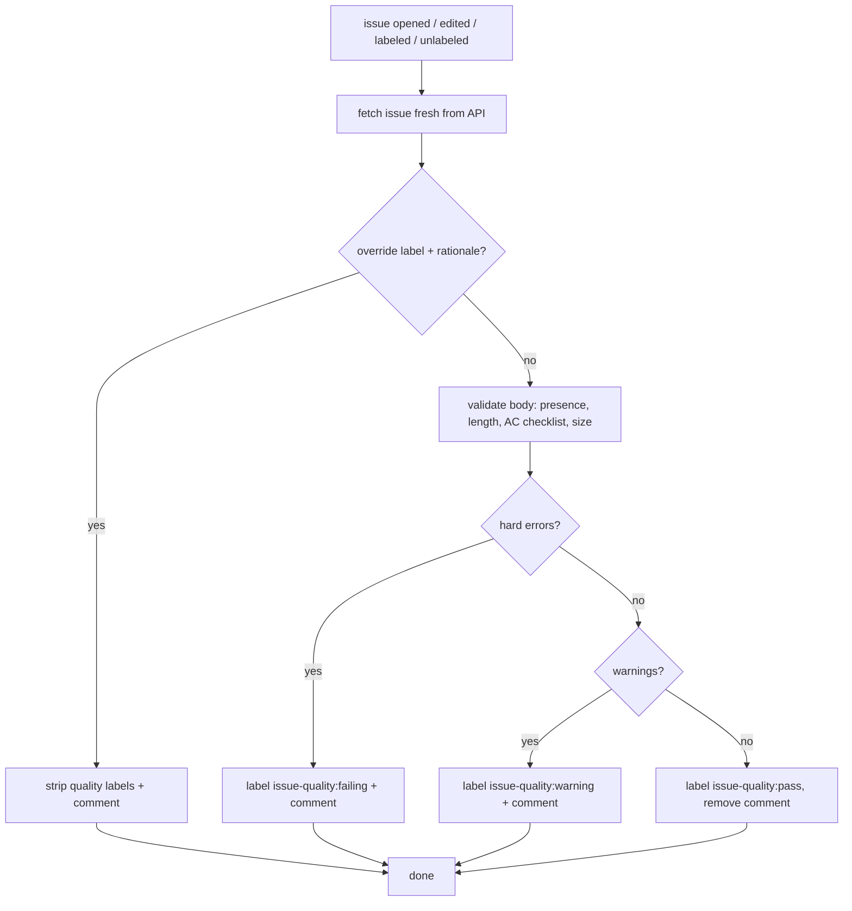

# issue-quality-gate

A deterministic quality gate for GitHub issues, so they are reliable input for
autonomous coding agents. Structural checks only (presence, length, checklist
count, size enum). No LLM judgment.

See [docs/design.md](docs/design.md) for the full rationale.

## Requirements

Node.js ≥ 18, both on the CI runner that executes the Action and locally for the
`npx` CLI. The Action calls the runner's ambient `node` directly (no
`setup-node` step), so a self-hosted runner must have a compatible version on
`PATH`; `ubuntu-latest` already ships one.

## What it checks

| Field | Rule | Severity |
| --- | --- | --- |
| **Context** | present, ≥ 30 chars | error |
| **Context** | ≤ 1500 chars | warning (fluff detector) |
| **Acceptance Criteria** | ≥ 1 non-empty checklist item (`- [ ]`) | error |
| **Out of Scope** | present, ≥ 10 chars | error |
| **Size** | one of `XS / S / M / L / XL` | error |
| **Size** | not `L` / `XL` (too big for one agent run) | error |

One mutually-exclusive label always reflects the outcome:

| Outcome | Label |
| --- | --- |
| ≥ 1 hard error | `issue-quality:failing` |
| 0 errors, ≥ 1 warning | `issue-quality:warning` |
| clean | `issue-quality:pass` |

`failing` and `warning` also post (and keep updated) a single bot comment
explaining the result; `pass` carries no comment, and any stale comment is
removed.

### Override

Set the `override:issue-quality` label **and** add a non-empty
`## Override rationale` section to the issue body to bypass the gate: all
quality labels and the bot comment are stripped. The label without a rationale
section does not bypass; instead it raises a warning telling you to write one.

## Issue flow



## Opting a repo in

```sh
npx github:orestes-dev/issue-quality-gate init
```

This drops two files, which together are the opt-in:

- `.github/ISSUE_TEMPLATE/task.yml`: the Issue Form (canonical schema).
- `.github/workflows/issue-quality.yml`: a thin workflow calling the shared
  Action, pinned to `@main`.

Commit both. CI runs on `issues: opened` / `edited` always, and on
`labeled` / `unlabeled` only when a human touches the `override:issue-quality`
or an `issue-quality:*` label. The gate writes its own labels as the CI bot,
whose events are excluded, so it never re-triggers itself; a human hand-editing
a quality label re-runs the gate, so manual changes self-heal.

Run `init` from the repository root: `.github/` is only read there. Blank issues
(and any `gh issue create` with a freeform body) skip the Issue Form and land as
`issue-quality:failing`, so nothing bypasses the gate. To also stop people
opening blank issues, add `.github/ISSUE_TEMPLATE/config.yml` with
`blank_issues_enabled: false` yourself; `init` deliberately leaves that
repo-wide choice to you.

## Pre-flight validation (agent side)

Before creating an issue via `gh issue create`, run the same validator locally:

```sh
npx github:orestes-dev/issue-quality-gate validate path/to/issue-body.md
```

The file must use the same `### ` section headings GitHub's Issue Form renders,
since the validator keys off those. Draft the body against this skeleton:

```md
### Context

<what needs to happen and why>

### Acceptance Criteria

- [ ] <verifiable outcome>

### Out of Scope

- <explicit non-goal>

### Size

S
```

Exits non-zero on hard errors. One shared validator backs both this and CI, so
the rules cannot drift.

## Architecture

- `src/schema.js`: single source of truth for fields, limits, labels.
- `src/validator.js`: pure, dependency-free, regex-free parse + validate.
- `src/action.js`: CI entry, reconciles labels, upserts the bot comment.
- `bin/cli.js`: `init` and `validate` commands.
- `action.yml`: composite Action consumed by opted-in repos.

The schema is fixed, not configurable per repo, so the label convention means
the same thing everywhere.
