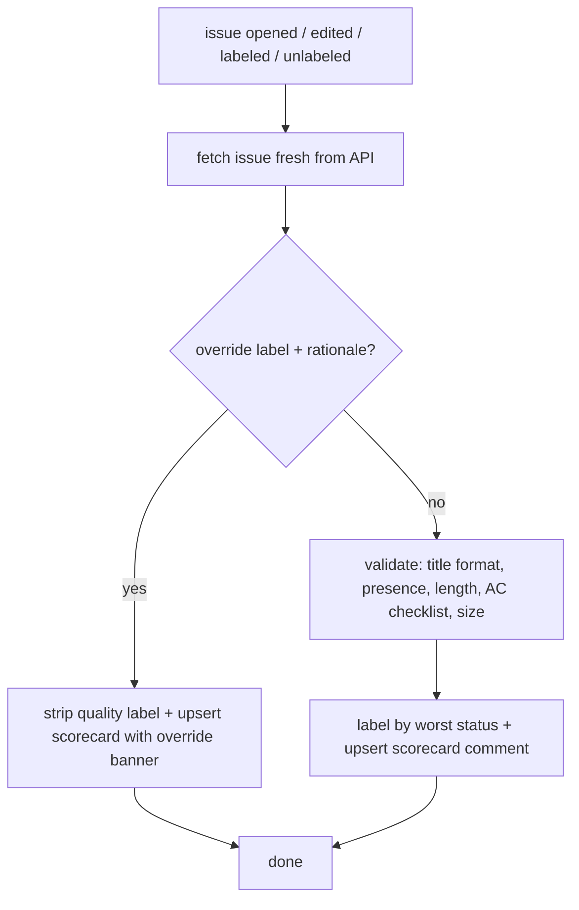

# repo-contract

A deterministic repository contract for GitHub **issues**, **pull requests**, and
**commits**, so work lands well-scoped and actionable. It runs structural checks
only (title format, presence, length, checklist count, size enum), the same way
every time, and reports each verdict as a label plus a scorecard comment.

## What it provides

Three gates, a CLI, and a set of vendored git hooks, all driven by one shared
core (`src/rules.js`).

| What                                        | Kind               | Blocks merge? | Namespace                                           |
| ------------------------------------------- | ------------------ | ------------- | --------------------------------------------------- |
| [Issue quality gate](#issue-quality-gate)   | GitHub Action      | No (advisory) | `issue-quality:*`                                   |
| [Pull request gate](#pull-request-gate)     | GitHub Action      | Once required | `pr-readiness:*`                                    |
| [Commit-hygiene gate](#commit-hygiene-gate) | GitHub Action      | Once required | `commit-hygiene:*`                                  |
| [CLI](#the-cli)                             | `npx` command      | n/a           | `init` / `validate-issue` / `validate-pr` / `sweep` |
| [Git hooks](#git-hooks)                     | Vendored git hooks | Local commit  | reads `.repo-contract.json`                         |

- **Issue quality gate**: labels + a scorecard on every issue. Advisory: it never
  fails CI, it just marks the issue `issue-quality:{pass,warning,failing}`.
- **Pull request gate**: checks a PR's title and required sections, and that every
  issue it closes is gate-cleared. Hard-fails CI.
- **Commit-hygiene gate**: the CI mirror of the local git hooks (Conventional
  Commits, em-dash policy, no default-branch commits). Hard-fails CI.
- **CLI**: `init` installs a chosen subset of the above into a repo (see
  [Scaffolds](#scaffolds)); `validate-issue` / `validate-pr` run the same checks
  locally before you open the object; `sweep` backfills labels across an existing
  backlog.
- **Git hooks**: committed hooks that enforce the same baseline as the
  commit-hygiene gate, locally, with `sh` + `git` + `jq` only, never
  `node_modules`, so they run before any install. That strict dependency budget
  is why the hooks re-implement the Conventional-Commits check in sh rather than
  reusing a library the CI gate can (ADR
  [0015](docs/adr/0015-commit-hooks-keep-the-sh-jq-dependency-budget.md)). `init`
  activates them in the checkout it runs in; no shim and no install required.

A red check only _blocks_ once its context is a required status check on the
default branch. That is a repository setting no repo can commit, so `init` cannot
ship it, and until someone sets it a failing gate reports and the PR merges
anyway. `init` ends with a **Protection** line reporting which side of that line
the repo is on; it reports and never configures protection, since requiring a
currently-red check blocks every open PR at once (ADR
[0014](docs/adr/0014-init-reports-gate-enforcement-never-mutates-it.md)).

Common threads across all three gates:

- **Deterministic**: structural checks only, identical every run. No per-repo
  config changes what a label means.
- **One label per object**: exactly one mutually-exclusive verdict label, a
  filterable signal for downstream automation.
- **A scorecard on every run**: one upserted comment with a ✅ / ⚠️ / ❌ line per
  check, so a clean object gets confirmation, not silence.
- **A written override**: a labelled escape hatch that always requires a
  `## Override rationale`, so a bypass is legible, never silent.

## Quick start

Opt a repo in from its root:

```sh
npx github:orestes-dev/repo-contract init
```

On a terminal this asks which **scaffolds** to install; anywhere else it installs
all of them. The three scaffolds and the flags that pick them are below.

### Scaffolds

repo-contract is installed in three independently-selectable units. There is no
dependency between them, so any subset installs coherently (ADR
[0016](docs/adr/0016-init-scaffolds-are-three-coupled-units.md)):

| Scaffold         | What it installs                                                                 |
| ---------------- | -------------------------------------------------------------------------------- |
| `quality-gates`  | the issue gate and the PR gate: both Forms, both Author guides, both workflows   |
| `commit-hygiene` | the commit-hygiene workflow, the un-silenceable CI mirror of the commit baseline |
| `git-hooks`      | the two vendored git hooks, bypassable fast local feedback on that same baseline |

The issue and PR gates are **one** scaffold rather than two, because the PR gate's
linked-issue check reads the issue gate's `issue-quality:*` labels: installing the
PR gate alone would fail every PR that closes an issue. Coupling them dissolves
that dependency instead of managing it. The commit-hygiene gate and the git hooks
enforce the same baseline on different surfaces, and different repos genuinely
want one without the other (CI enforcement without imposing hooks on contributors,
or the reverse), so they stay separate.

`quality-gates` drops seven files:

- `.github/ISSUE_TEMPLATE/task.yml`: the Issue Form (GitHub-UI rendering of the
  `src/rules.js` structure, drift-checked against it).
- `.template.issue.md`: the [issue Author guide](#author-guides) (the LLM-facing
  rendering of the same structure).
- `.github/workflows/issue-quality.yml`: a thin workflow calling the shared Action
  at `@main` for the issue gate.
- `.github/PULL_REQUEST_TEMPLATE.md`: the PR Form (required sections), the body
  GitHub posts on a new PR.
- `.template.pr.md`: the [PR Author guide](#author-guides), byte-identical to the
  PR Form, the path an agent drafts a PR body against.
- `.github/workflows/pr-readiness.yml`: a thin workflow calling the shared Action
  at `@main` for the PR gate (merge-blocking).

`commit-hygiene` drops one: `.github/workflows/commit-hygiene.yml`, a thin
workflow calling the shared Action at `@main` (merge-blocking). No Form or Author
guide: it reads the PR's commits and diff, not a body the author fills in.

`git-hooks` vendors two [git hooks](#git-hooks) under `.repo-contract/hooks/` and
activates them in this checkout by setting `core.hooksPath`.

Commit whatever lands. Which scaffolds a run installs is decided by the first of
these that applies:

1. `--only <ids>`, a comma-separated list: `init --only git-hooks,commit-hygiene`.
   The scriptable path. An unrecognized id exits 2 and lists the known ones.
2. An interactive prompt, when both ends are a terminal and something is not yet
   installed. It offers only the **absent** scaffolds and lists the installed ones
   above as fixed context.
3. The selection already recorded in `.repo-contract.json`.
4. All three, when the repo has no record at all.

**`init` only ever adds.** A selection that would drop an installed scaffold exits
non-zero, names what it would drop, and points at `uninstall`; deselection has
exactly one home, so a command whose job is to install can never leave a scaffold
enforcing under a manifest that denies it. In a fully-installed repo there is
nothing left to offer, so a re-run or an `init --force` upgrade never stops for
input.

The selection is recorded as a `scaffolds` array in
[`.repo-contract.json`](#enforcement-opt-outs), rewritten whenever the selection
changes and left untouched when it does not, so a repo that formats the file owns
its bytes. **An absent key means none installed**, not all-in: a repo scaffolded before the manifest
existed takes one `init` run to record what it already has, done deliberately
rather than inferred from disk. Files belonging to a scaffold the manifest does
not list are **orphans**: `init` reports them, and never creates, removes, or
blocks on them. An orphaned `git-hooks` that `core.hooksPath` still points at is
reported as still enforcing, since that is the case worth knowing about.

`init` then creates the label schema the selection needs. All-in, that is the three gate triples
(`issue-quality:*`, `pr-readiness:*`, `commit-hygiene:*`), the three override
labels (`override:issue-quality`, `override:pr-readiness`, `override:commit-hygiene`),
and `wontfix` (which marks an issue as a [rejection](#rejections)), each with a
code-owned colour and description. `wontfix` carries GitHub's own default colour
and description, so a repo that never recoloured it sees no change. Re-running `init` repairs any of
them whose colour or description has drifted, so the labels mean the same thing
in every repo. This step needs credentials and repo context (discovered from
`gh auth token` and `gh repo view`); with neither it is reported as skipped and
the file scaffolding still succeeds.

Where `quality-gates` was installed, `init` then prints a **Suggested rule** to
stdout: an agent-guidance snippet pointing at the issue and PR Author guides and
at the pre-flight step, for you to paste into your own agent-rules file
(`AGENTS.md`, `CLAUDE.md`, editor rules).
`init` writes it to no file, so it never clobbers a file it does not own. The
snippet names no subcommand or flag and defers to `repo-contract --help` for the
command surface, so a pasted copy never pins something that later rots: `--help`
is generated from the live CLI and cannot go stale.

Re-running `init` later is safe: unchanged files are left alone. If a bundled
template has moved on and your copy is stale (or you edited it locally), `init`
writes nothing and exits 1, listing what drifted. Only an **installed** scaffold's
drift blocks that run. Re-run `init --force` to overwrite the drifted files in
place; since they are committed, `git diff` afterwards shows exactly what changed
and lets you restore any local edits.

## Issue quality gate

The advisory gate. It validates an issue's structure and labels it, but never
fails CI.

### What it checks

The fields and their headings are owned in code by the ordered descriptor in
[`src/rules.js`](src/rules.js), read at runtime; the Issue Form
([`.github/ISSUE_TEMPLATE/task.yml`](.github/ISSUE_TEMPLATE/task.yml)) is a
drift-checked rendering of it for GitHub's new-issue UI, never read at runtime.
The table below is the human-readable bar for the rules layered on top.

| Field                             | Rule                                          | Severity                 |
| --------------------------------- | --------------------------------------------- | ------------------------ |
| **Title**                         | Conventional Commits `type(scope): summary`   | error                    |
| **Context**                       | present, ≥ 30 chars                           | error                    |
| **Context**                       | ≤ 1500 chars                                  | warning (fluff detector) |
| **Acceptance Criteria**           | ≥ 1 non-empty checklist item (`- [ ]`)        | error                    |
| **Out of Scope**                  | present, ≥ 10 chars                           | error                    |
| **Decisions**                     | present (settled choices + rationale)         | warning if empty         |
| **Affected files / entry points** | present (files/symbols the work touches)      | warning if empty         |
| **Depends on**                    | optional (prerequisite issues / merge order)  | none                     |
| **Size**                          | one of `XS / S / M / L / XL`                  | error                    |
| **Size**                          | not `L` / `XL` (too big to land as one issue) | error                    |

Title is issue metadata, not a body section, so it leads the scorecard rather
than being derived from the field descriptor. Decisions and Affected files are
optional but recommended: empty raises a non-blocking warning, since both sharpen
an issue for whoever (human or agent) implements it.

### Labels and the scorecard

The worst per-check status sets one mutually-exclusive label:

| Outcome               | Label                   |
| --------------------- | ----------------------- |
| ≥ 1 error             | `issue-quality:failing` |
| 0 errors, ≥ 1 warning | `issue-quality:warning` |
| clean                 | `issue-quality:pass`    |

Every run upserts the scorecard comment, an override included: no run ever leaves
an issue without one.

```md
### Issue Quality Checklist

- ✅ **Title**: Conventional Commits: `type(scope): summary`
- ✅ **Context**: 30–1500 characters
- ✅ **Acceptance Criteria**: at least one checklist item
- ❌ **Out of Scope**: at least 10 characters
- ⚠️ **Decisions**: recommended; add it so implementers aren't left guessing
- ✅ **Affected files / entry points**: present
- ✅ **Depends on**: optional; not provided
- ✅ **Size**: XS, S, or M lands as one issue
```

### Rejections

An issue labelled `wontfix` records work deliberately declined, and owes a
written `## Rejection rationale` section saying why it was declined and what
would reopen the question. The label is the only signal: an open `wontfix` issue
counts, and the close reason is never read. The check is added to the usual field
checks rather than replacing them, since a declined issue whose original what and
why are unreadable is no more useful than one with no reason recorded. A missing
or empty rationale is an error; a rationale too thin to say anything is a
warning. Nobody writes this section when opening an issue, so it appears in
neither the Issue Form nor the Author guide.

### Override

Set `override:issue-quality` **and** add a non-empty `## Override rationale`
section to bypass: the quality label is stripped, but the scorecard stays and
leads with a banner acknowledging the bypass, so the record of what the gate found
survives the override. The label without a rationale does not bypass; it raises a
warning to write one.

### When CI runs

CI runs on `issues: opened` / `edited` always, and on `labeled` / `unlabeled` only
when a human touches `override:issue-quality`, `wontfix`, or an `issue-quality:*`
label. The
gate's own label writes (as the CI bot) are excluded, so it never re-triggers
itself; a human hand-editing a quality label re-runs it, so manual changes
self-heal.

Blank or freeform issues (any `gh issue create` body) skip the form and land as
`issue-quality:failing`, so nothing bypasses the gate. To stop blank issues
entirely, add `.github/ISSUE_TEMPLATE/config.yml` with `blank_issues_enabled:
false` yourself.

The gate labels issues going forward, from the first event on each. To label the
existing backlog too, run [`sweep`](#sweep) once after opting in.

### Consuming the gate's output

The labels are a filterable signal for downstream automation (or a saved search).
An issue is **gate-cleared** when the gate cleared it or a human waived the block:
`issue-quality:pass`, `issue-quality:warning` (non-blocking by design), or
`override:issue-quality`. Query clearance as a positive union of those labels:

```text
is:issue is:open label:issue-quality:pass,issue-quality:warning,override:issue-quality
```

GitHub OR's comma-separated `label:` terms, so this matches any of the three.
Filter to only pristine issues by dropping the last two terms; that is a
stricter-than-cleared policy a consumer opts into, not the default meaning of
clearance.

Do **not** express clearance as `-label:issue-quality:failing`. The negative form
also matches issues the gate never evaluated (opened before CI ran, a repo not
opted in, a run still in flight), which carry no quality label at all. Clearance
requires an affirmative signal that the gate reached a verdict, so always list the
cleared labels explicitly.

Gate-clearance means the issue is legible, not that it is ready to implement.
Whether the design is settled is a separate, downstream decision (e.g. a
consumer's own `ready-to-implement` label) the gate does not make; don't read
pickup-readiness into a cleared label.

### Flow



## Pull request gate

The merge-blocking gate for PRs. It runs the same core over a pull request on
`pull_request` events and checks structural presence, never conformance:

- **Title**: Conventional Commits `type(scope): summary`, same rule as issues.
- **Required sections**: `## Summary`, `## Verification`, `## Scope`, and
  `## Decisions` present and non-empty. `Scope` names the app/package/area the PR
  touches (a repo's own governance may enforce the boundary itself); `Decisions`
  records the settled choices and any ADR added or followed (`None` is a valid,
  explicit answer). Both mirror the issue gate's `Decisions` and affected-files
  vocabulary, so a PR and the issue it closes speak the same sections.
- **Divergence**: the `## Divergence` section is optional until its checkbox is
  checked. A checked flag with no written rationale hard-fails; unchecked (or
  checked with a rationale) passes. The gate checks the rationale is present, never
  whether the code conforms to the issue.
- **Linked-issue readiness**: every issue the PR closes (GitHub's native
  `closingIssuesReferences`, from `Closes #N` or the Development sidebar) must be
  gate-cleared, the same `issue-quality:pass` / `warning` / `override:issue-quality`
  union a consumer uses to pick up an issue. A PR that closes zero same-repo issues
  hard-fails, since each closed issue is a spec it claims to satisfy. Cross-repo
  links are ignored (the token can't read another repo's labels) and the scorecard
  says so. The check re-runs only on PR events, so when a linked issue flips to
  cleared afterward the scorecard tells you to re-run it.

The PR structure is defined by a code descriptor (`src/pr-validator.js`), the
source of truth the Markdown template is drift-tested against. Any error (a missing
section, a non-conventional title) **hard-fails CI**, turning the check red and
blocking merge; warnings stay green. Outcomes carry exactly one of
`pr-readiness:pass` / `pr-readiness:warning` / `pr-readiness:failing` plus an
upserted **PR Readiness Checklist** scorecard, both diff-based like the issue gate.

Bot-authored PRs (actor login ends in `[bot]`) auto-pass with no override, since no
human is present to apply one. A human bypasses with `override:pr-readiness` plus a
`## Override rationale` section, mirroring the issue override. The consumer workflow
lives in [`templates/workflow/pr-readiness.yml`](templates/workflow/pr-readiness.yml)
and needs `permissions: pull-requests: write`, `contents: read`, and
`issues: read`. The last is required so the linked-issue readiness check can read
the labels of same-repo issues the PR closes (`closingIssuesReferences`). Without
`issues: read` the gate hard-fails every PR that uses `Closes #N`.

It also triggers on `synchronize`, so a push re-runs it. Nothing a push changes
can move the verdict, since the gate reads the title, body, and linked issues.
The re-run exists because a required status check is a property of the commit,
not of the PR: the check-run stays on the SHA it ran against, so a PR whose head
moved would be evaluated against a head carrying no `pr-readiness` check-run at
all, and protection blocks on an absent check with nothing in flight to clear it
([ADR 0019](docs/adr/0019-a-required-gate-runs-on-every-head-sha.md)).

## Commit-hygiene gate

The merge-blocking mirror of the local [git hooks](#git-hooks). It runs the same
core over a pull request on `pull_request` events (including `synchronize`, so a
push re-runs it). It is the CI mirror of the repo-contract baseline the git hooks
enforce, which `--no-verify` bypasses and which is absent entirely in a checkout
where nobody ran `init` to set `core.hooksPath`. The gate makes that baseline **un-silenceable rather
than un-bypassable**: always overridable, never invisible (ADR 0002,
orestes/dotfiles#52). It checks three rules across the PR:

- **Commit subjects**: every commit's subject follows Conventional Commits
  `type(scope): summary`. Merge, revert, fixup, and squash subjects are exempt,
  matching the `commit-msg` hook. Opt out per repo with `skipConventionalCommits`.
- **Em dashes**: no em dashes added on `*.md`/`*.mdx` lines in the diff, matching
  the `pre-commit` hook. `maxAllowedEmDashes` sets a budget (default 0);
  `allowEmDashes` skips the check entirely.
- **Default branch**: the PR is not opened from the default branch. Opt out with
  `allowDefaultBranchCommits`.

Each rule reads its opt-out from the committed `.repo-contract.json` (see
[Enforcement opt-outs](#enforcement-opt-outs)), not per-machine `git config`, so a
relaxation is durable and reviewable; a relaxed check passes with a scorecard line
quoting the recorded reason. Any un-relaxed violation **hard-fails CI**, turning the
check red and blocking merge. Outcomes carry exactly one of `commit-hygiene:pass` /
`commit-hygiene:warning` / `commit-hygiene:failing` plus an upserted **Commit
Hygiene Checklist** scorecard, both diff-based like the other gates.

The namespace (`commit-hygiene:*` / `override:commit-hygiene`) is deliberately
distinct from `issue-quality` and `pr-readiness`, so one override never waives
unrelated checks. Bot-authored PRs (actor login ends in `[bot]`) auto-pass with no
override. A human bypasses the whole gate with `override:commit-hygiene` plus a
`## Override rationale` section, mirroring the issue and PR overrides; neither the
label nor the section alone suffices. The consumer workflow lives in
[`templates/workflow/commit-hygiene.yml`](templates/workflow/commit-hygiene.yml)
and needs `permissions: pull-requests: write` and `contents: read`.

## The CLI

One `npx github:orestes-dev/repo-contract <command>` binary, five commands. Run
`npx github:orestes-dev/repo-contract --help` for the live surface.

### `init`

Installs a selected subset of the three [scaffolds](#scaffolds) into a repo (see
[Quick start](#quick-start)). `--only <ids>` selects them explicitly, a terminal
prompts for the ones not yet installed, and `--force` upgrades drifted copies in
place. `init` only ever adds; removing a scaffold is `uninstall`'s job.

`init` ends with a **Protection** line reporting whether the merge-blocking PR
gate is actually enforced. Vendoring the workflow makes the check **run**; only a
required-status-check rule on the default branch makes it **block**, and that rule
lives in repository settings no repo can commit, so `init` cannot ship it and the
enforcing half drifts unseen (ADR 0014). The line reads the `pr-readiness` context
against both classic branch protection and rulesets, using the `gh` session `init`
already opened:

| Reported        | Meaning                                             |
| --------------- | --------------------------------------------------- |
| `required`      | the context is required; the gate really does block |
| `not-required`  | the branch is protected, but not on this context    |
| `unprotected`   | the branch has no protection or ruleset at all      |
| `not-installed` | no `pr-readiness*.yml` vendored yet                 |
| `unreadable`    | a 403 hid the answer; re-run with admin scope       |

`unreadable` is reported as ok, not a warning: reading protection needs admin
scope, and a permissions boundary is an unknown, never a verdict. The report never
affects `init`'s exit code, and never configures protection: requiring a check
that is currently red blocks every open PR at once, so it stays a deliberate human
act. Do it once the gate is green on the PRs you care about, by adding
`pr-readiness` to the default branch's required status checks.

### `uninstall`

The single home for deselection, the teardown counterpart to `init`'s
install-only stance (ADR 0016). `init` refuses a selection that would drop an
installed scaffold and points here; `uninstall <ids>` removes exactly the named
[scaffolds](#scaffolds) and nothing adjacent, reading the same per-scaffold
manifest `init` installs from. Ids are positional, space- or comma-separated.

It is deliberately conservative, the mirror of `init`'s assertiveness:

- **Files.** Only the files the named scaffolds vendor are deleted. This is also
  the one tool that resolves an **orphan** (files on disk the manifest never
  recorded): name its scaffold and the files go.
- **Manifest.** The `scaffolds` key is rewritten to what remains; removing the
  last scaffold deletes the key entirely, since "nothing installed" has one
  representation (the absent key), never `[]`.
- **Hooks.** Uninstalling `git-hooks` unsets this repo's local `core.hooksPath`
  only when it still holds the managed `.repo-contract/hooks` value, handing
  activation back to any global tier-1 hooks. `uninstall` releases only the value
  it set: anything else here (an operator's own directory, or a leftover from a
  prior install) is not its to delete, so it is left alone and reported.
- **Remote labels are never deleted.** They are applied to live issues and PRs,
  so `uninstall` names them as manual cleanup (`gh label delete <name>`) rather
  than removing them.

Uninstalling a scaffold that is neither recorded nor on disk is a no-op that says
so, not an error. An unknown id exits 2 and lists the known ones.

### `validate-issue` and `validate-pr`

Run the same checks locally before you open the object, so you find gaps before CI
does.

```sh
# Issue body; --title also checks the title against Conventional Commits
npx github:orestes-dev/repo-contract validate-issue path/to/issue-body.md \
  --title "feat(search): debounce the query input"

# PR body; the PR-side mirror of validate-issue
npx github:orestes-dev/repo-contract validate-pr path/to/pr-body.md \
  --title "feat(search): debounce the query input"
```

Both exit non-zero on hard errors. One validator backs both CI and pre-flight.
Without `--title` the title check is skipped (a body file carries no title).
`validate-pr` evaluates only what is knowable locally (section presence + title);
it never attempts linked-issue readiness, which stays CI-authoritative (no PR
exists yet to resolve `closingIssuesReferences`).

An issue body file must use the same `### ` headings the gate requires (Decisions,
Affected files, and Depends on are optional):

```md
### Context

<what needs to happen and why>

### Acceptance Criteria

- [ ] <verifiable outcome>

### Out of Scope

- <explicit non-goal>

### Decisions

- <settled choice: rationale>

### Affected files / entry points

- <path/to/file: symbol>

### Size

S
```

### `sweep`

Opt-in is going-forward only: an existing issue is validated the next time it is
edited, so an untouched backlog stays unlabeled. To backfill on demand, run:

```sh
npx github:orestes-dev/repo-contract sweep
```

`sweep` labels + scorecards every **open** issue that has no `issue-quality:*` label
yet, running each through the same gate the CI action does. It takes no flags: it
reads credentials from `gh auth token` and the target repo from `gh repo view`, so
run it inside an authenticated clone of the repo.

- **Idempotent and re-runnable.** Already-labeled issues are filtered out server
  side, so they are never touched or re-notified; only unlabeled issues are swept.
  Re-running only picks up new arrivals.
- **Resilient.** A failure on one issue is reported and the sweep continues; the run
  exits non-zero if any issue failed, so you can re-run to retry just those.
- **Backlogs over 1000.** GitHub caps issue search at 1000 results. Because sweeping
  labels an issue (dropping it from the query), `sweep` prints a notice when more
  remain; re-run until it stops.

Labels are created on first use with intentional colors and descriptions, so `sweep`
(or the first CI run) also materializes the three `issue-quality:*` labels in the
repo; there is no separate label-setup step.

## Author guides

`init` drops two LLM-facing companions to the Forms, so an agent drafting an issue
or PR body has the examples and voice the GitHub YAML/Markdown cannot carry.

- **`.template.issue.md`** is the companion to the Issue Form: a section per field
  carrying the examples, voice, and guidance the form cannot hold. It is a rendering
  of the same `src/rules.js` structure as the Issue Form: only its headings and
  their order are drift-checked; its prose is deliberately richer and free to differ.
- **`.template.pr.md`** is the companion to the PR Form, and unlike the issue guide
  it is byte-identical to the native template: `init` writes the one canonical
  `templates/markdown/pr.md` to both `.github/PULL_REQUEST_TEMPLATE.md` (the body
  GitHub posts) and root `.template.pr.md` (the path an agent drafts against), and a
  drift test keeps the two the same bytes. Because those bytes end up in the posted
  PR body, all authoring guidance lives in HTML comments so it never prints into the
  PR (ADR 0003).

GitHub ignores both files (neither name is a reserved template path, so they never
pollute the new-issue chooser or the PR body). The Suggested rule points agents at
them.

## Enforcement opt-outs

Some enforcement (the shipped commit hooks and the commit-hygiene gate) can be
relaxed per repo through a committed `.repo-contract.json` at the repo root. It
replaces the per-machine `git config hooks.*` flags, which were invisible,
per-machine, and survived no clone (ADR 0002, orestes/dotfiles#52). An opt-out here
is durable, shows up in a diff, and carries the reason it exists.

The file is optional: with it absent, every check runs at full enforcement with no
opt-outs. It is plain JSON, parsed with `JSON.parse` (no added dependency), so `jq`
queries it directly:

```json
{
  "scaffolds": ["quality-gates", "git-hooks"],
  "overrides": {
    "maxAllowedEmDashes": {
      "value": 34,
      "reason": "AGENTS.md is generated and contains 33"
    },
    "allowDefaultBranchCommits": {
      "value": true,
      "reason": "policy: direct commits to main are fine here"
    }
  }
}
```

Keys:

- **`scaffolds`**: the install manifest, written by `init` (see
  [Scaffolds](#scaffolds)). An authoritative whitelist of what is installed,
  rewritten whenever the recorded selection changes; an absent key means none
  installed. It is a plain list,
  not reason-bearing: an install manifest is not a bypass of an active rule, so
  there is nothing to justify. Every id must name a known scaffold and the array
  is never empty; both are hard errors on every surface that reads the file,
  because an id read as "not installed" would let a later selection drop a live
  scaffold without the refusal firing.
- **`overrides`**: a map from an opt-out key to an `{ "value", "reason" }` object.
  Omit it (or the whole file) for full enforcement. Any other top-level key is
  reserved: the file may grow to hold further package settings.
- **`value`**: what the check keys off. A boolean for an on/off opt-out (e.g.
  `allowDefaultBranchCommits`, `allowEmDashes`, `skipConventionalCommits`), or a
  number for a budget (e.g. `maxAllowedEmDashes`).
- **`reason`**: required and non-empty. Why the opt-out exists. It is a data field,
  not a comment, so a triggered check quotes it in its output (the em-dash budget
  message, say, names the file that consumed the budget). An opt-out missing a
  `reason` is a hard error, so a bypass is never silent.

Query one reason on the shell:

```sh
jq -r '.overrides.maxAllowedEmDashes.reason' .repo-contract.json
```

Two consumers read these opt-outs: the [commit-hygiene gate](#commit-hygiene-gate)
in CI and the [git hooks](#git-hooks) locally, keyed off the same four
(`skipConventionalCommits`, `maxAllowedEmDashes`, `allowEmDashes`,
`allowDefaultBranchCommits`). Both read the same committed file, so a repo's baseline
relaxations are identical on a developer's machine and in CI.

## Git hooks

`init` vendors two committed git hooks that enforce the repo-contract baseline
every consumer must obey, including CI and contributors with no `~/.dotfiles`
(ADR 0002, orestes/dotfiles#52):

- **`.repo-contract/hooks/commit-msg`**: the subject matches Conventional Commits, and the message
  carries no em-dash. Opt-outs: `skipConventionalCommits`, `allowEmDashes`.
- **`.repo-contract/hooks/pre-commit`**: no commit lands on the default branch, and staged
  `*.md`/`*.mdx` carry no em-dash beyond `maxAllowedEmDashes`. Opt-outs:
  `allowDefaultBranchCommits`, `maxAllowedEmDashes` (a budget).

These hooks and the [commit-hygiene gate](#commit-hygiene-gate) enforce the same
rules at two different points, and the difference is latency, not redundancy. The
hook fires pre-commit, before the offending commit exists: recovery is free, you
branch and re-commit. The gate, and the branch protection it backs, fires at push
or merge, after the commit is already in local history: recovery means unwinding it
off the default branch, and the cost compounds once you have stacked more commits
on top. The remote is the authority (a local hook is bypassable with `--no-verify`
and absent until `init` runs), so it is the layer you can never drop; the hook is a
fast shadow of that authority, not a second one, moving the failure to the cheapest
point to fix. The two are meant to agree. When the local hook permits what the
remote denies (a stale `allowDefaultBranchCommits` left on a repo whose default
branch is now protected) you get the worst case: no early warning and the full
remote-recovery cost. Keep each opt-out in sync with the branch's actual protection.

They are committed files, not a delegation to a global path, so they run where
`~/.dotfiles` is absent: CI runners, containers, fresh worktrees. They depend only
on `sh`, `git`, and `jq` (and `jq` only when a `.repo-contract.json` exists), never
on `node_modules`, so they run before `yarn install`. Each reads its opt-outs from
the committed `.repo-contract.json` via `jq` and quotes the triggered opt-out's
`reason` in its output, so a bypass is legible where it takes effect.

### Activating them

Git runs a hook only when `core.hooksPath` points at it, and that setting is
per-clone git config which no repository can commit. So `init` sets it: where this
repo's **local** config leaves it unset, it writes both hooks executable and
points `core.hooksPath` at `.repo-contract/hooks`, reporting the step as `create`
or (when the managed value is already set) `ok`. Git then executes the committed
files directly, with no shim, no `node_modules`, and no package-manager install. Where a
repository exists and the setting cannot be written, `init` exits non-zero and
says the baseline is not enforced; hooks that quietly do nothing are the failure
this replaces (ADR 0012).

`init` owns only the value it set. A **foreign** local `core.hooksPath` is any
value other than `.repo-contract/hooks` (a stale `.husky` from an old install,
your own hooks directory, a deliberate absolute path): one repo-contract did not
write, so it is not repointed (ADR 0020, the mirror of the way `uninstall`
releases only the managed value and keeps anything else). Because a vendored hook
git will never invoke is inert, a foreign value **blocks the `git-hooks` scaffold
only**: it is
detected in the pre-flight, none of its files are written, the other scaffolds
install unaffected, and the run reports the block and exits non-zero. Resolve it
either way the block names: unset the value
(`git config --local --unset core.hooksPath`) and re-run `init`, or re-run with
`--overwrite-hooks-path` to have repo-contract adopt `.repo-contract/hooks`. That
flag is distinct from `--force` (which upgrades drifted committed files, recoverable
via `git diff`): a local `core.hooksPath` is committed nowhere, so overwriting it is
unrecoverable, and `init` prints the value it displaced. On a terminal, `init`
prompts for the same opt-in instead of requiring the flag.

Neither remedy costs you the hooks that value was pointing at. `core.hooksPath`
is single-valued, so whatever held it (another hook manager, a plain
`.git/hooks`, your own directory) stops being invoked once `.repo-contract/hooks`
takes the slot; those hooks keep running if you move their bodies into
`.repo-contract/hooks/local/pre-commit` and `.repo-contract/hooks/local/commit-msg`,
which the shipped hooks chain to on every commit. That is the adoption path for
any prior hook setup, and repo-contract builds no migration for a specific one:
moving the bodies is a consumer-owned step, since `init` never writes under
`.repo-contract/hooks/local/` and deletes nothing in your tree (ADR 0021).

The managed value is deliberately relative. `core.hooksPath` lives in the shared
`.git/config` that every linked worktree reads, so an absolute path pins them all
to one fixed checkout's hooks, and a worktree on another branch runs rules it
never committed. `.repo-contract/hooks` resolves against each worktree's own root instead, so
every worktree runs its own branch's hooks. repo-contract only ever writes the
relative form, so an absolute value is foreign like any other and blocks rather
than being silently relativised.

Run `init` once per clone. A checkout where nobody ran it has the hook files on
disk and no local enforcement, which nothing local can detect; the
[commit-hygiene gate](#commit-hygiene-gate) is the un-bypassable copy of the same
rules in CI. To activate without the CLI:
`git config core.hooksPath .repo-contract/hooks`.

repo-contract owns both files byte-for-byte and drift-checks them with the same
`init`/`--force` machinery as the Forms and workflows: a tampered or stale hook is
reported `stale` on a plain `init` and repaired in place by `init --force`. Edit the
canonical `templates/git-hooks/*` upstream and re-run `init`; never patch a dropped copy
in place, or the next `init` flags it as drift.

Repo-specific checks (lint-staged, gitleaks, build) are tier-3 project checks, not
this hook's concern. Put them in `.repo-contract/hooks/local/commit-msg`
or `.repo-contract/hooks/local/pre-commit`; the shipped hooks chain to those if
present, and `init` never writes under `.repo-contract/hooks/local/`, so they
survive `init --force`.

## How it fits together

Structure and rules both live in `src/rules.js` (the ordered field descriptor plus
the constraints), read at runtime; the Issue Form YAML is a drift-checked rendering
of that structure.

`templates/` is the canonical bundle `init` copies into a consumer, grouped into
the three [scaffolds](#scaffolds) by [`src/scaffolds.js`](src/scaffolds.js), which
maps each one to its files, its labels, and whether it claims `core.hooksPath`:
`templates/form/task.yml` (the Issue Form), `templates/markdown/issue.md` (the issue
Author guide), `templates/markdown/pr.md` (the PR Form, written to both the GitHub
template path and the root PR Author guide), the thin workflows
`templates/workflow/issue-quality.yml`, `pr-readiness.yml`, and `commit-hygiene.yml`
(each emitting its own gate namespace: `issue-quality:*`, `pr-readiness:*`, and
`commit-hygiene:*`), and `templates/git-hooks/{commit-msg,pre-commit}` (the git hooks).

This repo's own `.github/`, root `.template.{issue,pr}.md`, and
`.repo-contract/hooks/{commit-msg,pre-commit}` are a dogfood instance of that bundle:
a plain consumer install, byte-identical to its source in every path with no
exception, so `init` reports every file `ok` here exactly as it does anywhere else.
One table-driven drift test walks the manifest and asserts that
([ADR 0018](docs/adr/0018-the-dogfood-instance-is-a-plain-consumer.md)).

[`CONTEXT.md`](CONTEXT.md) is the domain glossary: Issue Form, structure, field,
section, rule, check, scorecard, override.

## Notes

- **`@main`, unpinned.** Consumers reference `orestes-dev/repo-contract@main`, so
  rule changes propagate on the next run with no per-repo bump, accepting that a bad
  change affects every opted-in repo at once.
- **Fixed schema.** No per-repo config or inputs, so the labels mean the same thing
in every repo. The gate reads structure from its own `src/rules.js`, not your copy
of the form, so the scaffolded `task.yml` is not meant to be edited: renaming a
heading or changing the size options makes submitted issues stop matching, and
every one is marked failing.
</content>
